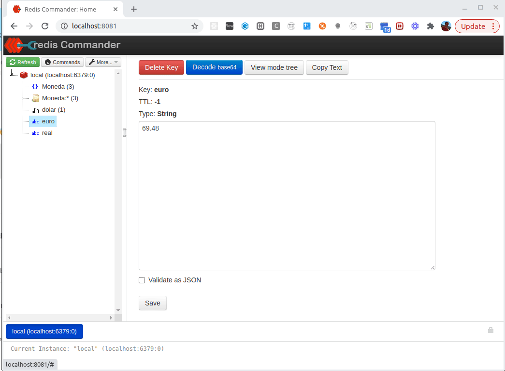
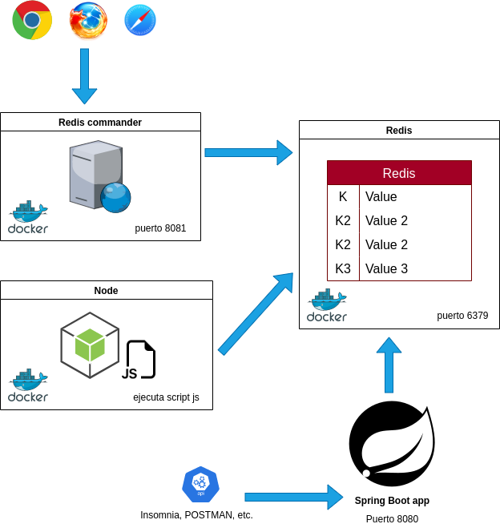
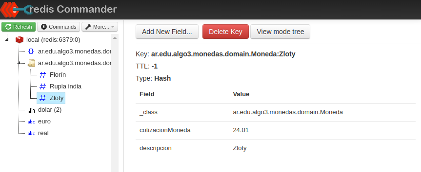
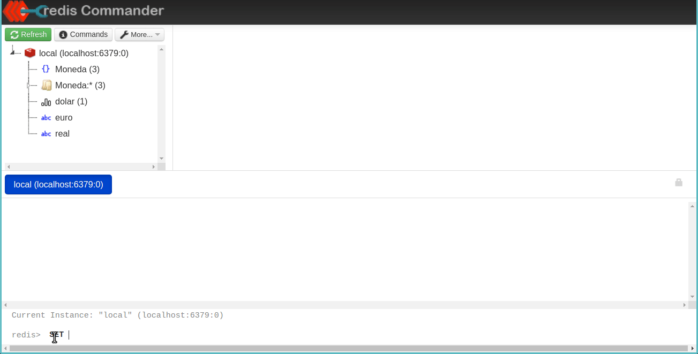

# Ejemplo Monedas con Springboot y Redis

[](https://github.com/uqbar-project/eg-monedas-springboot-redis-kotlin/actions/workflows/build.yml) [](https://codecov.io/gh/uqbar-project/eg-monedas-springboot-redis-kotlin)

## Instalación del entorno Redis

Solo hace falta tener instalado Docker Desktop (el pack docker engine y docker compose), seguí las instrucciones de [esta página](https://phm.uqbar-project.org/material/software) en el párrafo `Docker`.

```bash
docker compose up
```

Eso te levanta 

- una base clave/valor en el puerto por defecto (el 6379) 
- el cliente Redis Commander
- y por último, ejecuta un [script en Node](./datosInicialesNode/cargaDatosInicial.js) para crear algunas monedas (que no utilizaremos en la aplicación)

Entonces podés ir a un navegador y utilizar el cliente Redis Commander:

```bash
http://localhost:8081/
```



Les dejamos un diagrama de la arquitectura a alto nivel:



## Endpoints en springboot

### Objetos de dominio

Nuestro modelo en Springboot no va a trabajar con los datos iniciales que generamos en Node, sino que va a tener una estructura más **opaca**, determinada por las annotations de nuestro objeto de dominio Moneda:

```kt
@RedisHash("Moneda")
class Moneda {
    @JsonIgnore
    lateinit var cotizacionMoneda: BigDecimal

    @Id
    lateinit var descripcion: String
```

- `@RedisHash` es la clave que va a agrupar todos los objetos Moneda en una lista de hashes en Redis, que es un mapa clave/valor. También crea un set de valores (útil para el findAll)
- `@Id` es el índice interno por el cual vamos a poder recuperar una moneda, por ejemplo "Zloty" o "Rupia india"



### Repositorio

La interfaz que propone Spring boot con Redis es idéntica a la del modelo relacional (aun cuando su implementación es bastante diferente):

```kt
interface MonedaRepository : CrudRepository<Moneda, String> {}
```

Como la interfaz ya propone `findAll` y `findById` que es lo que queremos hacer, no tenemos que definir mensajes adicionales.

### Service

El service define dos métodos de conversión:

```kt
protected fun getMoneda(conversion: Conversion) =
    monedasRepository
        .findById(conversion.monedaAConvertir)
        .orElseThrow { NotFoundException("La moneda a convertir no existe") }

@Transactional(readOnly = true)
fun convertirMonedaAPesos(conversion: Conversion) =
    getMoneda(conversion).convertirAPesos(conversion.valorAConvertir)

@Transactional(readOnly = true)
fun convertirPesosAMoneda(conversion: Conversion) =
    getMoneda(conversion).convertirDePesosAMoneda(conversion.valorAConvertir)
```

La anotación `@Transactional(readOnly = true)` indica al service que no debe iniciar una transacción. De esa manera utiliza menos recursos.

### Controller

Vamos a definir tres endpoints:

- uno que permita conocer todas las monedas
- otro que convierta de pesos a una moneda en cuestión
- y otro que convierta de la moneda en cuestión a pesos

El primer endpoint se implementa con un método GET, los otros dos si bien no tienen efecto colateral, necesitamos pasar cierta información y nos parece mejor hacerla por el body antes que tener que encadenar en la URL todos los valores por query params.

La implementación de la búsqueda de todas las monedas delega a un service de Springboot. Tampoco es muy complejo el endpoint de conversión, solo que

- nos fue útil modelar el service para que busque la moneda y haga la conversión
- si no encuentra la moneda el service tira un error NotFoundException que se termina mapeando con un código de error de http 404
- delegamos al objeto de dominio la responsabilidad de la conversión (no olvidarse de dejar que cada objeto cumpla su responsabilidad)

Por último, en el archivo `ErrorHandling.kt` definimos la asociación de la excepción con un código de error http:

```kt
@ResponseStatus(HttpStatus.NOT_FOUND)
class NotFoundException(override val message: String) : RuntimeException(message)

@ResponseStatus(HttpStatus.BAD_REQUEST)
class UserException(override val message: String) : RuntimeException(message)
```

### Testeo de integración

Tenemos que levantar el servicio de Redis antes de ejecutar los tests de integración, algo que también hacemos en el build del CI. 

Los casos de prueba son:

- la conversión de una moneda X a pesos
- la conversión de pesos a una moneda X
- que al tratar de convertir una moneda inexistente recibimos un código de error 404

Los elementos involucrados en el test de integración son:

- controller
- service
- repositorio
- objetos de dominio mapeados contra Redis

```kt
@SpringBootTest
@AutoConfigureMockMvc
@ActiveProfiles("test")
@DisplayName("Dado un controller de monedas")
class MonedaControllerTest {
    @Autowired
    lateinit var mockMvc: MockMvc

    val mapper = ObjectMapper()

    @Test
    @DisplayName("podemos convertir de una moneda a pesos")
    fun conversionAPesos() {
        val conversion = Conversion(BigDecimal(10), "Zloty")
        mockMvc.perform(
            MockMvcRequestBuilders.put("/monedaAPesos).contentType(MediaType.APPLICATION_JSON).content(
                mapper.writeValueAsString(conversion)
            )
        )
            .andExpect(MockMvcResultMatchers.status().isOk)
            .andExpect(MockMvcResultMatchers.jsonPath("$").value("240.1"))
    }
```

## Cómo testear la aplicación

Te dejamos ejemplos para

- [Bruno](./Monedas_Bruno.json)
- [Insomnia](./Monedas_Insomnia.json)
- [Postman](./Monedas_Postman.json)

## Acceso desde Redis Commander

Desde Redis Commander también podés definir claves manualmente, como por ejemplo una clave con TTL (Time To Leave) para que al cabo de un tiempo la clave deje automáticamente de estar en la cache:



## Links recomendados

- [Lista de comandos disponibles en Redis](https://redis.io/commands/)
- [Curso de Springboot con Redis](https://developer.redis.com/develop/java/redis-and-spring-course)
- [Cómo trabajar con diferentes tipos de datos en Redis](https://redis.io/docs/reference/patterns/twitter-clone/)
- [Caso de uso práctico: Retwis-J, modelando Twitter con Redis](https://docs.spring.io/spring-data/data-keyvalue/examples/retwisj/current/)
